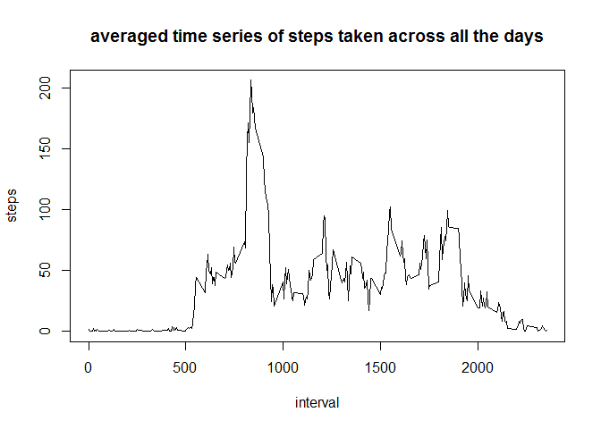
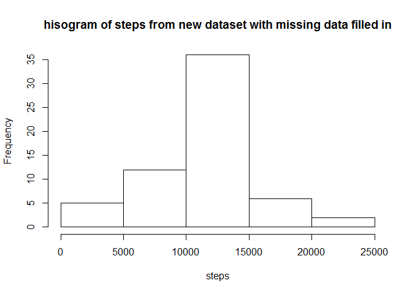
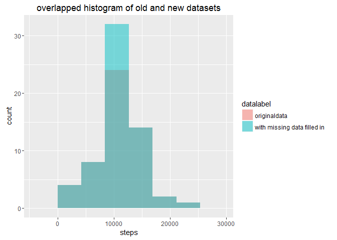
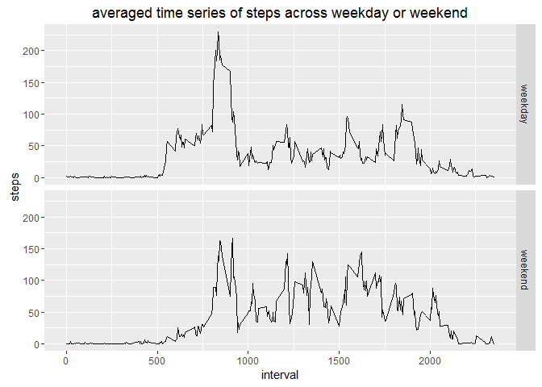
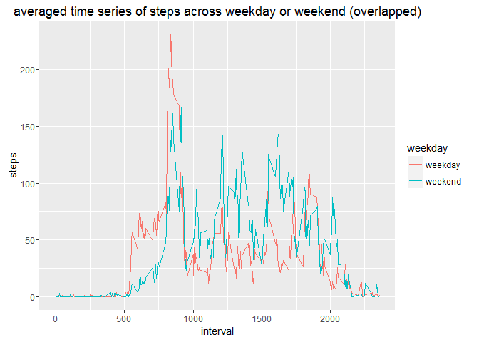

# Reproducible Research: Peer Assessment 1


## Loading and preprocessing the data
**import the packages that will be used , import data, transform the class of date and skip the NA values**
**Here is the code**

```r
library(dplyr)
library(ggplot2)
rawdata<-read.table("activity.csv", header=TRUE, sep=",",na.strings="NA", stringsAsFactors=FALSE)
rawdata$date<-as.Date(rawdata$date, "%Y-%m-%d")
nonNAdata<-subset(rawdata, !is.na(steps))
```

## What is mean total number of steps taken per day?
**Here is the code**

```r
bydate<-nonNAdata %>% group_by(date) 
everydaytotal <- bydate %>% summarise_each(funs(sum),steps)

meansteps<-with(everydaytotal, mean(steps, na.rm=TRUE))
mediansteps<-with(everydaytotal, median(steps, na.rm=TRUE))
with(everydaytotal, hist(steps, breaks=5))
```


\
*The mean of total number of steps taken per day is* **10766.19**\
*the median of total number of steps taken per day is* **10765**


## What is the average daily activity pattern?

```r
avetimeseries<-nonNAdata %>% group_by(interval) %>% summarise_each(funs(mean),steps)
with(avetimeseries, plot(interval,steps, type="l", main="averaged time series of steps taken across all the days"))
```



```r
peakinterval<-avetimeseries$interval[which.max(avetimeseries$steps)]
```
The **835**th interval contains the maximum number of steps

## Imputing missing values
use mean value for each interval to make up the missing values


```r
missingdata<-subset(rawdata,is.na(steps))
missingdata<-select(missingdata, -steps)
makeupdata<-merge(missingdata, select(avetimeseries,c(steps,interval)), by.x="interval", by.y="interval")

newdata<-rbind(nonNAdata,makeupdata)
newdata<-arrange(newdata, date, interval)

newtotalsteps<- newdata %>% group_by(date) %>% summarise_each(funs(sum), steps)

with(newtotalsteps, hist(steps, breaks=5, main="hisogram of steps from new dataset with missing data filled in"))
```



```r
newmeansteps<-mean(newtotalsteps$steps)

newmediansteps<-median(newtotalsteps$steps)
```
\
total number of missing values is **2304**\
*The mean of total daily steps in new dataset with missing data filled in is* **10766.19**\
*the median of total daily steps in new dataset with missing data filled in is* **10766.19**
The mean value is the same between the new and old data.
The median is slightly impacted by the making up of missing data.

The impact of making up missing values on distribution of daily steps can be revealed by the following script and plot:


```r
datalabel<-c(rep("originaldata",each=nrow(everydaytotal)),rep("with missing data filled in", each=nrow(newtotalsteps)))

dailysteps<-cbind(rbind(everydaytotal,newtotalsteps),datalabel)

his_together<-ggplot(dailysteps, aes(steps, fill = datalabel))+geom_histogram(alpha=0.5, bins=5, position = 'identity')+ ggtitle("overlapped histogram of old and new datasets")

print(his_together)
```


\
As shown in the above overlapping histogram, making up missing value increases the peak bar of the histogram.


## Are there differences in activity patterns between weekdays and weekends?
The following code assigns "weekday" or "weekend" to the each observation based on date. And the averaged pattern of steps along intervals are plotted for weekdays and weekend.  

```r
wkdy<-weekdays(newdata$date)
newdata$weekday<-as.factor(ifelse((wkdy!="Saturday"& wkdy!="Sunday"), "weekday","weekend"))

wktimeseries<-newdata %>% group_by(weekday,interval) %>% summarise(mean(steps))

colnames(wktimeseries)[3]<-"steps"

p1<-ggplot(wktimeseries, aes(interval,steps))+geom_line()+facet_grid(weekday ~ .)+ggtitle("averaged time series of steps across weekday or weekend")
print(p1)
```


\


Overlapping plots can show the difference more clearly as shown in the following figure:

```r
p2 <- ggplot(wktimeseries,aes(interval,steps,colour = weekday))+geom_line()+ggtitle("averaged time series of steps across weekday or weekend (overlapped)")

print(p2)
```


\
The pattern of steps in weekdays is different from that in weekend as revealed by the above overlapped plots.  
